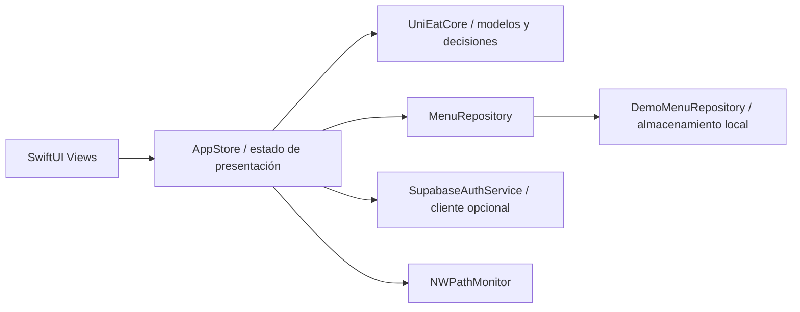

# UniEat para iOS

Aplicación SwiftUI para consultar y publicar menús del día cerca de Uniandes. El producto sigue la [wiki de UniEat](https://github.com/EstebanRojas01/Moviles/wiki) y las pantallas MS7 del Sprint 1. Esta entrega implementa el **cliente iOS**; el servicio compartido con Android queda para una integración posterior.

## Ejecutar en macOS

Requisitos: Xcode con un simulador de iPhone, [XcodeGen](https://github.com/yonaskolb/XcodeGen) y macOS compatible con el Xcode instalado.

```sh
brew install xcodegen
./scripts/bootstrap-ios.sh
```

El script genera `UniEat.xcodeproj` desde `project.yml` y lo abre en Xcode. Elegir el esquema **UniEat**, un simulador de iPhone y **Run**. La app requiere iOS 17 o posterior. No se necesitan cuentas, claves ni backend para recorrer la demo: en la pantalla inicial elegir **Soy estudiante** o **Soy restaurante**.

Para validar el paquete de reglas de negocio en macOS:

```sh
swift test --package-path Packages/UniEatCore
```

En Windows se puede editar el código y analizar la sintaxis con Swift para Windows, pero la app SwiftUI y el simulador requieren Xcode en un Mac. `scripts/swift-core-windows.ps1` prepara las herramientas de Swift y C++ locales para el paquete cuando el SDK de Windows esté configurado.

## Recorrido de la demo

| Rol | Flujo | Pantallas |
| --- | --- | --- |
| Estudiante | Entrar, explorar menús vigentes, filtrar por presupuesto/tiempo/dieta/zona/pago, abrir detalle, reportar un cambio y usar «Elige por mí» | Inicio, filtros, detalle, reporte, recomendación, perfil |
| Restaurante | Entrar, publicar, editar o cerrar un menú estructurado con platos/precios/vigencia y consultar señales de interés | Inicio, publicar, rendimiento, perfil |

Desde **Perfil → Explorar las 10 pantallas de MS7** se puede abrir cada vista del prototipo sin preparar datos ni cambiar de rol. El reporte se abre como hoja contextual. Las pantallas de restaurante están disponibles para revisar su diseño, pero guardar publicaciones requiere entrar en la demo como restaurante.

| MS7 | Pantalla | Ruta normal |
| --- | --- | --- |
| 01 | Hoy · Menús | Pestaña Hoy |
| 02 | Filtros | Hoy → Filtros |
| 03 | Detalle del menú | Hoy → tarjeta de menú |
| 04 | Elige por mí | Pestaña Elige por mí o Hoy → recomendación |
| 05 | Publicar menú | Pestaña Publicar con rol restaurante |
| 06 | Reportar un cambio | Detalle → Reportar un cambio |
| 07 | Sin conexión | Hoy → ejemplo sin conexión; también desde el aviso al simular falta de red |
| 08 | Sin menú publicado | Hoy → ejemplo de local sin menú |
| 09 | Espera sin evidencia | Detalle de un menú sin estimación → Ver por qué |
| 10 | Rendimiento | Pestaña Rendimiento con rol restaurante |

Las publicaciones de prueba, reportes y eventos se guardan localmente. El perfil ofrece un interruptor para simular falta de conexión. El feed indica la fecha de carga y excluye menús vencidos también en ese modo. Los ejemplos de restaurantes, platos y métricas son datos de demostración, no información real de comercios.

## Arquitectura



- **MVVM:** las vistas observan `AppStore`; el estado y las acciones no dependen de la vista concreta.
- **Observer:** `ObservableObject` y `@Published` actualizan el feed, los reportes y el rendimiento al cambiar el estado.
- **Repository:** `MenuRepository` abstrae la lectura y publicación de menús. La implementación actual usa `UserDefaults` para una demo autónoma.
- **Strategy:** `ContextualRankingStrategy` evalúa vigencia, presupuesto y dieta en un mismo plato, medio de pago y tiempo estimado cuando existe evidencia suficiente.
- **DTO/modelos:** `DailyMenu`, `MenuDish`, `FeedFilters`, `Profile` y `PerformanceSummary` son tipos `Codable` del paquete `UniEatCore`.
- **Adapter:** `SupabaseAuthService` encapsula el intercambio HTTP y el Keychain para autenticación opcional. Las decisiones online definitivas y la autorización del rol de restaurante deberán venir del servicio compartido.

### Decisiones de negocio del Sprint 2

| Integrante | BQ elegida | Implementación iOS |
| --- | --- | --- |
| Kevin Álvarez | **BQ-03:** qué menús vigentes son compatibles con presupuesto, dieta, zona y tiempo; ordenarlos con una explicación | `ContextualRankingStrategy`, filtros, feed y recomendación |
| Juan Esteban Rojas | **BQ-04:** estado de vigencia y reportes pendientes de una publicación | `PublicationAssessment`, ocultamiento al vencer, advertencias y formulario de reportes |

Estas son las responsabilidades acordadas para la entrega; este repositorio todavía no registra contribuciones individuales de Juan Esteban en commits. Los reportes locales permanecen **pendientes**: la app no los convierte en cambios confirmados. Una estimación de fila se muestra solo con al menos tres reportes y uno de los últimos 30 minutos.

## Configuración opcional de autenticación

`UniEatApp/Resources/BackendConfig.json` inicia con `supabaseURL` y `publishableKey` vacíos. Cuando exista un proyecto compartido, agregar allí la URL y la **clave pública** para habilitar ingreso y registro reales. No incluir claves secretas. El cliente guarda la sesión en Keychain. Hasta entonces, usar los dos botones de demo.

La configuración de autenticación **no** conecta el feed ni la publicación al backend. Menús, reportes y métricas siguen locales aun con una cuenta real. El rol enviado en `user_metadata` es solo una preferencia de interfaz y no prueba autorización de un restaurante. El backend compartido tendrá que validar propiedad y permisos, publicar menús, moderar reportes y producir métricas confiables.

Los archivos `supabase/` y `package.json` que ya estaban en el repositorio corresponden a la preparación local previa. Esta rama no implementa ni despliega el backend compartido.

## Estado de verificación

GitHub Actions en macOS ejecuta las pruebas de `UniEatCore`, genera el proyecto con XcodeGen y compila el cliente para el simulador. Antes de entregar en clase, validar en un iPhone o simulador las rutas de estudiante y restaurante y reemplazar los datos de muestra cuando el equipo conecte el servicio compartido.
