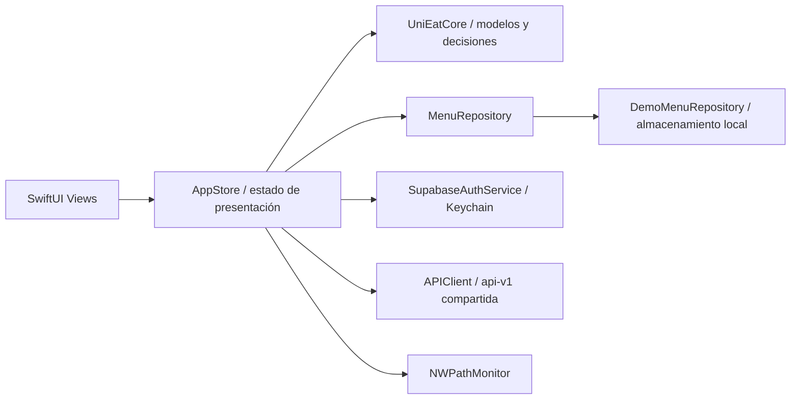

# UniEat para iOS

Aplicación SwiftUI para consultar y publicar menús del día cerca de Uniandes. El producto sigue la [wiki de UniEat](https://github.com/EstebanRojas01/Moviles/wiki) y las pantallas MS7 del Sprint 1. La app puede funcionar como demostración local o conectarse al [backend compartido](https://github.com/EstebanRojas01/UniEat---iOS-Back) mediante la API v1 de Supabase.

La trazabilidad de la rúbrica, los patrones, el pipeline de datos y el recorrido de la sustentación están en [docs/sprint2-sustentacion.md](docs/sprint2-sustentacion.md).

## Ejecutar en macOS

Requisitos: Xcode con un simulador de iPhone, [XcodeGen](https://github.com/yonaskolb/XcodeGen) y macOS compatible con el Xcode instalado.

```sh
brew install xcodegen
./scripts/bootstrap-ios.sh
```

El script genera `UniEat.xcodeproj` desde `project.yml` y lo abre en Xcode. Elegir el esquema **UniEat**, un simulador de iPhone y **Run**. La app requiere iOS 17 o posterior. No se necesitan cuentas, claves ni backend para recorrer la demo: en la pantalla inicial elegir **Soy estudiante** o **Soy restaurante**.

Para validar el paquete de reglas de negocio en macOS:

```sh
swift test --package-path Packages/UniEatCore
```

En Windows se puede editar el código y analizar la sintaxis con Swift para Windows, pero la app SwiftUI y el simulador requieren Xcode en un Mac. `scripts/swift-core-windows.ps1` prepara las herramientas de Swift y C++ locales para el paquete cuando el SDK de Windows esté configurado.

## Recorrido de la demo

| Rol | Flujo | Pantallas |
| --- | --- | --- |
| Estudiante | Entrar, explorar menús vigentes, filtrar por presupuesto/tiempo/dieta/zona/pago, abrir detalle, reportar un cambio y usar «Elige por mí» | Inicio, filtros, detalle, reporte, recomendación, perfil |
| Restaurante | Entrar, publicar, editar o cerrar un menú estructurado con platos/precios/vigencia y consultar señales de interés | Inicio, publicar, rendimiento, perfil |

Desde **Perfil → Explorar las 10 pantallas de MS7** se puede abrir cada vista del prototipo sin preparar datos ni cambiar de rol. El reporte se abre como hoja contextual. Para guardar publicaciones se necesita el rol restaurante de la demo o una cuenta real con un local aprobado.

| MS7 | Pantalla | Ruta normal |
| --- | --- | --- |
| 01 | Hoy · Menús | Pestaña Hoy |
| 02 | Filtros | Hoy → Filtros |
| 03 | Detalle del menú | Hoy → tarjeta de menú |
| 04 | Elige por mí | Pestaña Elige por mí o Hoy → recomendación |
| 05 | Publicar menú | Pestaña Publicar con rol restaurante |
| 06 | Reportar un cambio | Detalle → Reportar un cambio |
| 07 | Sin conexión | Hoy → ejemplo sin conexión; también desde el aviso al simular falta de red |
| 08 | Sin menú publicado | Hoy → ejemplo de local sin menú |
| 09 | Espera sin evidencia | Detalle de un menú sin estimación → Ver por qué |
| 10 | Rendimiento | Pestaña Rendimiento con rol restaurante |

En **Probar sin servidor**, las publicaciones, reportes y eventos se guardan localmente. Con una **cuenta real**, el feed, las publicaciones, los reportes y las métricas provienen de la API compartida. El perfil ofrece un interruptor para simular falta de conexión. La copia del feed se asocia a la cuenta y a sus filtros, indica cuándo se obtuvo y excluye menús vencidos o cerrados.

## Arquitectura


```mermaid
flowchart LR
    UI[SwiftUI Views] --> VM[AppStore / estado de presentación]
    VM --> Core[UniEatCore / modelos y decisiones]
    VM --> Repo[MenuRepository]
    Repo --> Demo[DemoMenuRepository / almacenamiento local]
    VM --> Auth[SupabaseAuthService / Keychain]
    VM --> API[APIClient / api-v1 compartida]
    VM --> Network[NWPathMonitor]
```

- **MVVM:** las vistas observan `AppStore`; el estado y las acciones no dependen de la vista concreta.
- **Observer:** `ObservableObject` y `@Published` actualizan el feed, los reportes y el rendimiento al cambiar el estado.
- **Repository:** `MenuRepository` mantiene la demostración autónoma en `UserDefaults`. Con una cuenta real, `APIClient` consulta la API compartida.
- **Strategy:** `ContextualRankingStrategy` evalúa la demostración local. En línea, el backend filtra y ordena con `rank-v1`; iOS conserva ese orden.
- **DTO/modelos:** `DailyMenu`, `MenuDish`, `FeedFilters`, `Profile` y `PerformanceSummary` son tipos `Codable` del paquete `UniEatCore`.
- **Adapter:** `SupabaseAuthService` gestiona autenticación y Keychain; `APIClient` adapta los DTO de la API v1. El backend decide el rol efectivo y comprueba los permisos de cada publicación.

### Decisiones de negocio del Sprint 2

| Integrante | BQ elegida | Implementación iOS |
| --- | --- | --- |
| Kevin Álvarez | **BQ-03:** qué menús vigentes son compatibles con presupuesto, dieta, zona y tiempo; ordenarlos con una explicación | Filtros, feed y recomendación. En línea consume el ranking y la explicación `rank-v1` del backend. |
| Juan Esteban Rojas | **BQ-04:** estado de vigencia y reportes pendientes de una publicación | Estado de publicación, ocultamiento al vencer o cerrar y reportes ligados a una versión. En línea consume la validez y el estado de moderación del backend. |

Una estimación de fila se muestra solo con al menos tres observaciones y una de los últimos 30 minutos. Las discrepancias quedan pendientes de revisión; `long_line`, `accurate` y `arrival` se registran como observaciones.

## Backend compartido y cuentas reales

`UniEatApp/Resources/BackendConfig.json` contiene la URL del proyecto Supabase y su **clave publicable**. Estas son credenciales de cliente; nunca incluir la clave secreta o de servicio. El cliente guarda los tokens en Keychain y usa `GET /me` para obtener el rol efectivo. `user_metadata.role` no concede permisos.

1. Crear cuenta e iniciar sesión. Si se confirmó el correo por email, iniciar sesión después de esa confirmación.
2. En **Perfil → Solicitar un establecimiento**, registrar nombre, zona, dirección y medios de pago. La solicitud queda pendiente.
3. Una cuenta con rol **Administrador** puede revisar y aprobar solicitudes desde **Perfil → Solicitudes de restaurantes**. El backend debe tener provisionado al menos un administrador confiable; registrar una cuenta con la opción «Restaurante» no la convierte en admin ni en dueño aprobado.
4. El dueño toca **Actualizar estado** en Perfil después de la aprobación. Aparecen las pestañas **Publicar** y **Rendimiento**.
5. Si administra varios locales, elige el local en **Publicar**. La app envía su `establishmentId`; las ediciones conservan el local de la publicación original.

Los menús, reportes, eventos y estadísticas de cuentas reales pertenecen al backend. Las pruebas y el despliegue del servicio están en el repositorio compartido; la demo local no escribe en él.

## Estado de verificación

GitHub Actions en macOS ejecuta las pruebas de `UniEatCore`, genera el proyecto con XcodeGen y compila el cliente para el simulador. Antes de entregar en clase, recorrer en un iPhone o simulador una cuenta de estudiante, una solicitud y aprobación de local, la publicación en cada local, un reporte y el cierre de un menú. La demo local sigue disponible para mostrar las pantallas sin conexión.
