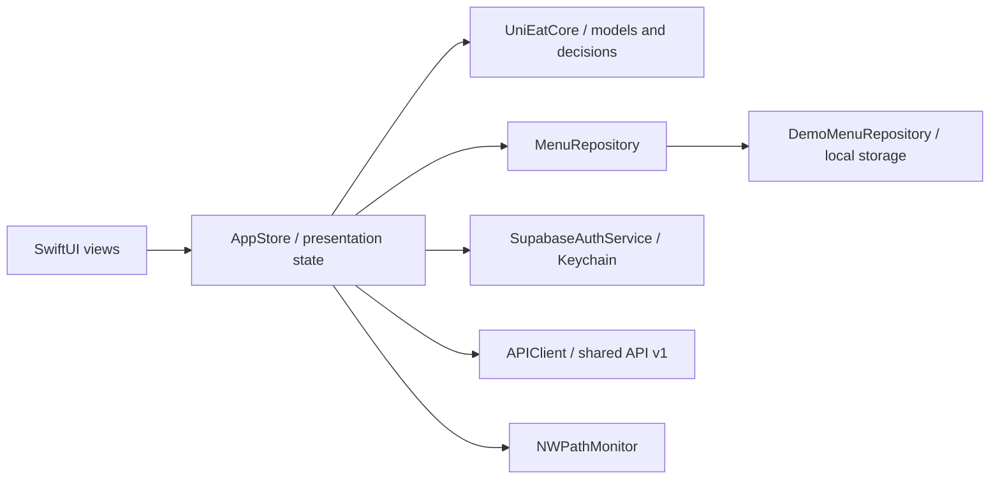

# UniEat for iOS

UniEat is a SwiftUI app for browsing and publishing daily menus near Universidad de los Andes. It follows the [UniEat project wiki](https://github.com/EstebanRojas01/Moviles/wiki) and the ten MS7 screens from Sprint 1. The app can run as a local demo or connect to the [shared backend](https://github.com/EstebanRojas01/UniEat---iOS-Back) through its Supabase API v1.

The rubric mapping, architecture and design patterns, data pipeline, and presentation walkthrough are documented in [docs/sprint2-sustentacion.md](docs/sprint2-sustentacion.md). That supporting document is in Spanish. The app interface is also in Spanish; UI labels below are quoted exactly as they appear on screen.

## Run on macOS

Requirements: Xcode with an iPhone simulator, [XcodeGen](https://github.com/yonaskolb/XcodeGen), and a macOS version supported by your installed Xcode.

```sh
brew install xcodegen
./scripts/bootstrap-ios.sh
```

The script generates `UniEat.xcodeproj` from `project.yml` and opens it in Xcode. Select the **UniEat** scheme, an iPhone simulator, and **Run**. The app requires iOS 17 or later. You do not need an account, API keys, or a running backend to explore the demo: choose **“Soy estudiante”** (student) or **“Soy restaurante”** (restaurant) on the welcome screen.

To run the business-rule package tests on macOS:

```sh
swift test --package-path Packages/UniEatCore
```

You can edit the code and check Swift syntax on Windows, but running the SwiftUI app or an iPhone simulator requires Xcode on a Mac. When the Windows SDK is configured, `scripts/swift-core-windows.ps1` prepares the local Swift and C++ tools for the core package.

## Demo walkthrough

| Role | Flow | Main screens |
| --- | --- | --- |
| Student | Browse current menus, filter by budget, time, diet, area, and payment method; open and save a menu, recover saved menus from Profile, open directions, report a change, and use **“Elige por mí”** (Pick for me). | Today, filters, menu detail, saved menus, report, recommendation, profile |
| Restaurant | Publish, edit, or close a structured menu with dishes, prices, and an expiration time; review metrics scoped to approved establishments. | Today, publish, my metrics, profile |

From **“Perfil” → “Explorar las 10 pantallas de MS7”** (Profile → Explore the ten MS7 screens), you can open the prototype views appropriate to your role without preparing data. Restaurant metrics are scoped to that restaurant's approved establishments; the combined BQ dashboard remains admin only. The report form appears as a contextual sheet. Publishing a menu requires either the restaurant demo role or a real account associated with an approved establishment.

| MS7 | Screen | Normal route in the Spanish UI |
| --- | --- | --- |
| 01 | Today's menus | **“Hoy”** tab |
| 02 | Filters | **“Hoy” → “Filtros”** |
| 03 | Menu detail | **“Hoy”** → menu card |
| 04 | Pick for me | **“Elige por mí”** tab or recommendation from **“Hoy”** |
| 05 | Publish a menu | **“Publicar”** tab with the restaurant role |
| 06 | Report a change | Menu detail → **“Reportar un cambio”** |
| 07 | Offline state | Offline example in **“Hoy”**, or the banner shown when simulating a lost connection |
| 08 | No published menu | Establishment-without-menu example in **“Hoy”** |
| 09 | Insufficient queue evidence | Menu detail without a wait estimate → **“Ver por qué”** |
| 10 | Performance | **“Mis métricas”** tab for restaurants; the combined **“Rendimiento”** tab for verified admins |

In **“Probar sin servidor”** (Try without a server), publications, reports, and events are stored locally. With a real account, the feed, publications, reports, and performance metrics come from the shared API. The profile has a switch to simulate a lost connection. The cached feed is scoped to the account and its filters, shows when it was fetched, and excludes expired or closed menus.

## Architecture


```mermaid
flowchart LR
    UI[SwiftUI views] --> VM[AppStore / presentation state]
    VM --> Core[UniEatCore / models and decisions]
    VM --> Repo[MenuRepository]
    Repo --> Demo[DemoMenuRepository / local storage]
    VM --> Auth[SupabaseAuthService / Keychain]
    VM --> API[APIClient / shared API v1]
    VM --> Network[NWPathMonitor]
```

- **MVVM:** SwiftUI views observe `AppStore`; presentation state and actions are separate from individual views.
- **Observer:** `ObservableObject` and `@Published` update the feed, reports, and performance view when state changes.
- **Repository:** `MenuRepository` abstracts local demo storage in `UserDefaults`. With a real account, `APIClient` requests data from the shared API.
- **Strategy:** `ContextualRankingStrategy` ranks the local demo feed. Online, the backend filters and ranks with `rank-v1`, and iOS preserves that order.
- **DTOs and models:** `DailyMenu`, `MenuDish`, `FeedFilters`, `Profile`, and `PerformanceSummary` are `Codable` types in `UniEatCore`.
- **Adapter:** `SupabaseAuthService` handles authentication and Keychain storage; `APIClient` adapts the API v1 contract. The backend determines each account's effective role and checks publication permissions.

### Sprint 2 business questions

| Team member | Selected business question | iOS implementation |
| --- | --- | --- |
| Kevin Álvarez | **BQ-03:** Which current menus match a student's budget, diet, area, and available time, and how should they be ranked and explained? | Filters, feed, and recommendation. Online, the app uses the backend's `rank-v1` ordering and explanations. |
| Juan Esteban Rojas | **BQ-04:** What is the current status of a publication, and which changes have been reported for its version? | The detail view fetches `GET /menus/:id`, displays the server's status, version, and pending report summaries, and refreshes after a report. Actions are disabled for unavailable publications. |

A queue estimate requires at least three distinct recent observations from the past 30 minutes. Reports such as `long_line`, `accurate`, and `arrival` are recorded as observations; discrepancies remain pending review. This rule was aligned with MS7 in [issue #8](https://github.com/k-alvarezr/UniEat---iOS/issues/8).

## Shared backend and real accounts

`UniEatApp/Resources/BackendConfig.json` contains the Supabase project URL and its **publishable key**. These are client-side configuration values; never add a secret or service-role key. The client stores tokens in Keychain and calls `GET /me` for the effective role. `user_metadata.role` does not grant permissions.

1. Create an account and sign in. If email confirmation is enabled, confirm the address before signing in.
2. In **“Perfil” → “Solicitar un establecimiento”** (Profile → Request an establishment), enter its name, area, address, and accepted payment methods. The request remains pending.
3. An **“Administrador”** (administrator) can approve restaurant requests and grant or revoke admin roles from **“Perfil”** (Profile). The backend must have one trusted administrator provisioned first. New accounts always start as students; restaurant access requires an approved establishment.
4. After approval, the owner taps **“Actualizar estado”** (Refresh status) in the profile. **“Publicar”** and **“Mis métricas”** then appear. The restaurant sees only its approved establishments' iOS activity. Only admins see the combined **“Rendimiento”** dashboard with BQ-03, BQ-04, and all engagement signals.
5. If the owner manages multiple establishments, they choose one in **“Publicar”**. The app sends its `establishmentId`; editing a publication keeps it attached to the original establishment.

Menus, reports, events, and statistics for real accounts belong to the backend. Its tests and deployment instructions live in the shared backend repository. The local demo does not write to that service.

## Verification status

GitHub Actions on macOS runs the `UniEatCore` tests, generates the Xcode project, and builds the client for an iPhone simulator. Before presenting the app, walk through a student account, an establishment request and approval, publishing for each establishment, reporting a change, and closing a menu on an iPhone or simulator. The local demo remains available for an offline screen tour.
