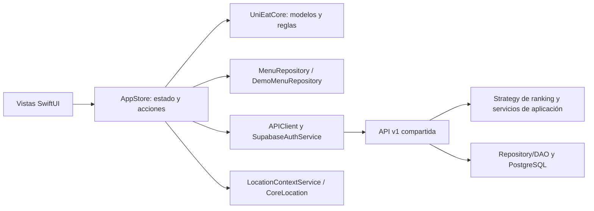
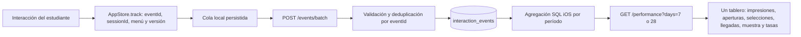

# Sprint 2: mapa verificable para la sustentación de iOS

Este documento conecta la [wiki del proyecto](https://github.com/EstebanRojas01/Moviles/wiki), la rúbrica de viva voce y el código. Los datos de demostración son **locales e ilustrativos**; para presentar métricas reales hay que entrar con una cuenta y usar el backend compartido. El equipo debe poder explicar y ejecutar cada flujo en el simulador o en un iPhone. Un documento o código generado con IA por sí solo no demuestra autoría ni comprensión.

## Preguntas de negocio elegidas

| Responsable en la wiki | Pregunta Type 2 | Evidencia que se puede demostrar |
| --- | --- | --- |
| Kevin David Álvarez Romero | **BQ-03:** ordenar publicaciones vigentes según presupuesto, dieta, zona y tiempo del estudiante | `FiltersView` cambia `FeedFilters`; `TodayFeedView` muestra el feed ordenado y la explicación; `RecommendationView` sugiere una opción. Con cuenta real, `GET /feed` usa `rank-v1` del backend. |
| Juan Esteban Rojas Castañeda | **BQ-04:** mostrar vigencia y cambios reportados de la publicación consultada | `MenuDetailView` muestra el estado y las advertencias; `ReportSheet` registra cambios ligados a la versión; el backend conserva historial y reportes pendientes. |

La autoría de los repositorios debe mostrarse con commits y PR reales: el cliente iOS está en este repositorio y el backend compartido en [`UniEat---iOS-Back`](https://github.com/EstebanRojas01/UniEat---iOS-Back). Juan Esteban debe revisar el PR de iOS y explicar el patrón y la función que implementó en el backend; no se le atribuye código Swift que no haya escrito.

## Arquitectura y patrones

- **Patrón arquitectónico MVVM (cliente):** `AuthView`, `FiltersView`, `TodayFeedView` y otras vistas observan `AppStore`. El store coordina acciones, estado y servicios. El paquete `UniEatCore` separa las decisiones puras de la presentación. Kevin debe explicar el recorrido de una interacción desde la vista hasta el estado y la API.
- **Arquitectura en capas (backend):** HTTP → servicios de aplicación/autorización → dominio → repositorio y PostgreSQL. Juan Esteban debe explicar el flujo real en `docs/architecture.md` del backend y demostrar su contribución con su commit/PR.
- **Design Pattern Repository:** `MenuRepository` es el contrato y `DemoMenuRepository` persiste/recupera menús locales. La vista no necesita conocer `UserDefaults`. En modo real, `APIClient` adapta la API v1; el backend tiene su propio repositorio de datos.
- **Design Pattern Strategy:** `FeedRankingStrategy` permite usar `ContextualRankingStrategy` para la demo. En modo real, la estrategia `rank-v1` del backend decide el orden; iOS conserva ese resultado. Las reglas se ejercitan en pruebas de `UniEatCore` y del backend. Estas implementaciones contienen decisiones y métodos concretos, no solo anotaciones.

## Pipeline de datos y métricas

Las cuatro señales Type 2 se registran donde ocurren: tarjeta del feed visible, detalle abierto, selección explícita y llegada autorreportada. La cola se reenvía al recuperar conexión; `eventId` evita duplicados. La API agrupa eventos iOS, devuelve `sampleSize` y omite tasas con menos de cinco sesiones o cero impresiones. Solo un administrador puede abrir **Rendimiento**. El dashboard HTML del backend reúne también las métricas BQ-03 y BQ-04 a partir de `feed_queries` y `menu_detail_queries`, actualizadas cada tres segundos. Las selecciones no son ventas; las llegadas no son visitas verificadas. El modo demo usa datos locales, pero no concede acceso a Rendimiento.

La BQ-03 usa publicaciones vigentes, precios y declaraciones dietarias de la API junto a filtros elegidos por la persona; `rank-v1` explica el orden. La BQ-04 deriva vigencia de marcas de tiempo y distingue reportes pendientes de actualizaciones confirmadas. El GPS solo sugiere un valor de zona para la BQ-03: no reemplaza la ubicación publicada ni se envía a la API. El umbral de 800 m es una regla de proximidad aproximada, no una medición de caminata o una frontera oficial de campus.

## Rúbrica: dónde comprobar cada criterio

| Criterio | Demostración y límite honesto |
| --- | --- |
| BQ / dashboard | El HTML admin del backend muestra métricas BQ-03 y BQ-04; Rendimiento iOS muestra cuatro conteos y dos tasas cuando la muestra basta. Todos usan datos reales y solo iOS. |
| Pipeline de datos | Diagrama anterior; mostrar evento en `AppStore.track`, llamada `/events/batch`, agregación y `/performance`. Sin datos fabricados en modo real. |
| Patrón arquitectónico por integrante | Kevin: MVVM de iOS; Juan Esteban: capas del backend. Cada uno debe explicar su código y sus commits. |
| Dos patrones de diseño | Repository y Strategy, con interfaces e implementaciones específicas. |
| Funcionalidad | Recorrer las pantallas MS7 desde Perfil; la décima aparece bloqueada para no admins. Luego ejecutar flujos normales de filtro, detalle, reporte, publicación y rendimiento con el rol apropiado. |
| Sensor | Filtros → **Sugerir zona con mi ubicación**: lectura puntual con CoreLocation. Probar permiso concedido, denegado e imprecisión. |
| BQ Type 2 | Feed contextual BQ-03 y vigencia/reporte BQ-04; eventos de interacción alimentan el tablero. |
| Context aware | Zona sugerida por proximidad a coordenadas publicadas; la persona puede mantener su zona manual. `NWPathMonitor` adapta el flujo a la conectividad. |
| Smart feature | «Elige por mí» usa el primer menú compatible del ranking explicado; no promete precisión donde faltan datos. |
| Autenticación | Alta, confirmación de correo si aplica, login, refresh y Keychain; `GET /me` obtiene el rol efectivo. El formulario aplica nombre de máximo 15 y contraseña de 6 a 20 con las cuatro clases requeridas. |
| Servicio externo | Supabase Auth y API v1 compartida para feed, reportes, publicaciones, eventos y métricas; la API es un servicio adicional a Auth. |

## Recorrido corto de prueba en Mac

1. Ejecutar `swift test --package-path Packages/UniEatCore` y generar/compilar el proyecto como indica el README.
2. Entrar en demo estudiante. Abrir Filtros, conceder ubicación en simulador y escoger una posición cercana a un pin de menú; comprobar sugerencia. Denegar o alejar la posición y comprobar el camino manual.
3. Aplicar filtros, abrir detalle, usar «Elige por mí», reportar un cambio y recorrer las pantallas disponibles. Comprobar que Rendimiento está bloqueado para estudiantes y restaurantes.
4. Probar alta con nombre de 16 caracteres y contraseña sin una clase; debe impedirse. Probar nombre de 15 y contraseña válida de hasta 20. Iniciar sesión real tras confirmar correo si el proyecto lo exige.
5. Con una cuenta restaurante aprobada, publicar un menú; desde estudiante provocar impresiones, aperturas, selecciones y una llegada. Entrar como admin para ver Rendimiento y el HTML BQ-03/BQ-04 en 7/28 días; comprobar conteos, muestra y supresión de tasas con poca evidencia.

**Límite de verificación:** Windows no ejecuta SwiftUI ni el simulador. El workflow `iOS` en GitHub Actions compila en macOS; una ejecución humana en simulador/iPhone sigue siendo necesaria para evaluar diseño, permisos, entrada y reabrir la app. El máximo de nombre/contraseña está aplicado en el cliente; para impedir cuentas creadas directamente contra Supabase con otras reglas haría falta una política del servicio de autenticación compartido.
